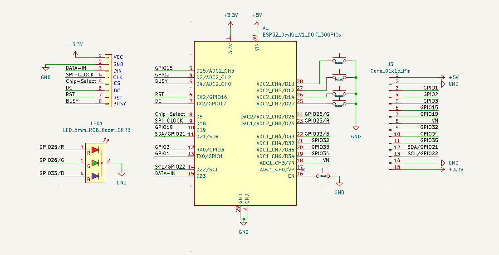
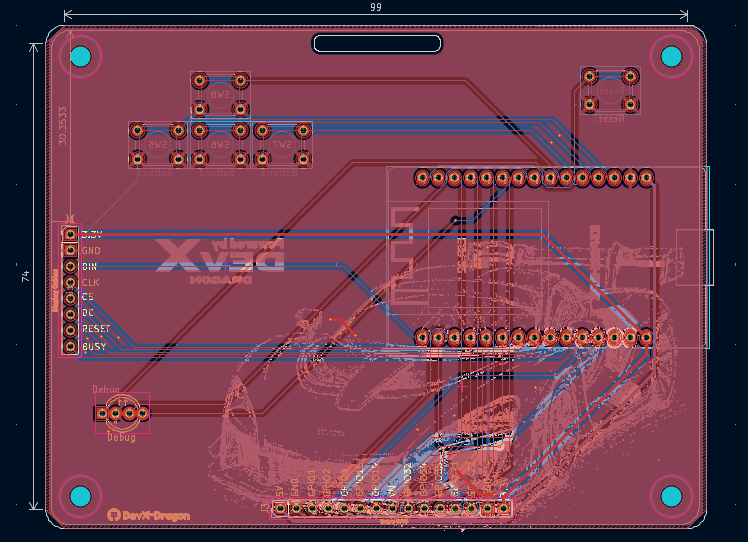
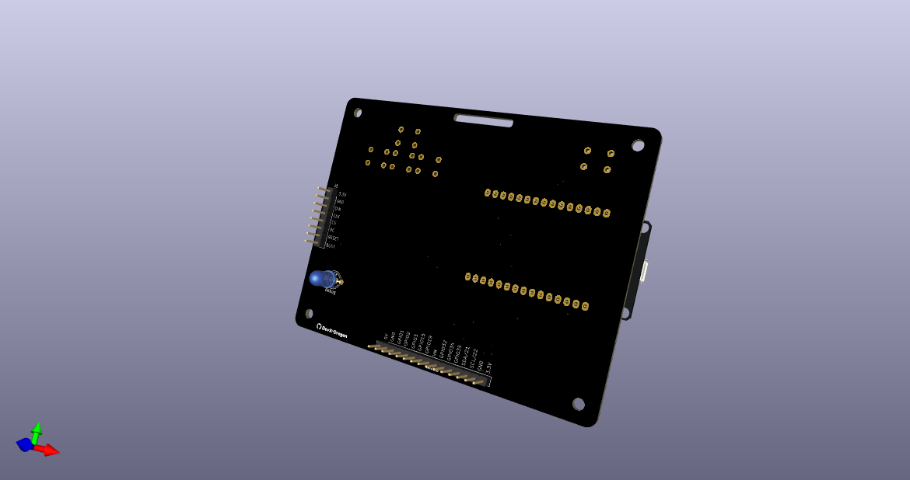

# HackBadge
**HackBadge** is an open-source badge, E-Ink Powered PCB badge desgined for hackathons, tech events or even maker events. Built around the ESP32. It provides low-power display capability, wireless connectivity and exapnsion for custom hardware.

## Features

- **ESP32 Microcontroller**: Integrated with WI-FI and Bluetooth LE (BLE) for networking, mesh communication, and OTA updates.
- **4.2 inch Waveshare E-Paper Display**: Ultra low-power, high visibility display that retains text and images even its powered off.
- **Programmale buttons**: Dedicated input buttons for navigating menus, switching displays or triggering a custom action.
- **Expaned GPIO Breakout**: Exposed GPIO pins allowing easy access for external sesors, LEDs and modules.

## Hardware Overview

### Schematics

### PCB Layout

### 3D View

## Pinout Mapping

Click here to see the detailed pinout diagram

### E-Ink Display (8-Pin Connector)
| E-Ink Pin | Signal Name | ESP32 Board Pin | Description |
| :--- | :--- | :--- | :--- |
| **Pin 1** | VCC | 3.3V (Pin 1) | Power supply (+3.3V) |
| **Pin 2** | GND | GND (Pin 2) | Ground connection |
| **Pin 3** | DIN | D23 (Pin 15) | SPI Data Input (MOSI) |
| **Pin 4** | CLK | D18 (Pin 9) | SPI Clock Line |
| **Pin 5** | CS | D5 (Pin 8) | SPI Chip Select |
| **Pin 6** | DC | TX2 / GPIO17 (Pin 7) | Data / Command Control Line |
| **Pin 7** | RST | RX2 / GPIO16 (Pin 6) | Hardware Reset Line |
| **Pin 8** | BUSY | D4 / ADC2_CH0 (Pin 5) | Display Busy Signal Output |

---

### RGB LED (LED1)
| LED Pin | Signal Name | ESP32 Board Pin | Description |
| :--- | :--- | :--- | :--- |
| **Pin 1** | G (Green Anode) | DAC2 / ADC2_CH9 / D26 (Pin 24) | Green LED Anode Control |
| **Pin 2** | GND | GND (Pin 2 / 29) | Common Cathode Ground |
| **Pin 3** | R (Red Anode) | DAC1 / ADC2_CH8 / D25 (Pin 23) | Red LED Anode Control |
| **Pin 4** | B (Blue Anode) | ADC1_CH4 / D33 (Pin 22) | Blue LED Anode Control |

> [!TIP]
> Optional information to help a user be more successful.

---

### Push Buttons
| Button | Signal Name | ESP32 Board Pin | Description |
| :--- | :--- | :--- | :--- |
| **Button1** | GPIO13 | ADC2_CH4 / D13 (Pin 28) | Pushbutton Input (Switches to GND) |
| **Button2** | GPIO12 | ADC2_CH5 / D12 (Pin 27) | Pushbutton Input (Switches to GND) |
| **Button3** | GPIO14 | ADC2_CH6 / D14 (Pin 26) | Pushbutton Input (Switches to GND) |
| **Button4** | GPIO27 | ADC2_CH7 / D27 (Pin 25) | Pushbutton Input (Switches to GND) |
| **RESET** | EN | EN (Pin 16) | Hardware Reset Switch (Switches to GND) |

> [!TIP]
> The buttons can be assigned to any functions you like.

---

### Extra GPIO Breakout Header (J3 - 15-Pin Connector)
| J3 Pin | Signal Name | ESP32 Board Pin | Description |
| :--- | :--- | :--- | :--- |
| **Pin 1** | +5V | VIN (Pin 30) | +5V Power Rail |
| **Pin 2** | GND | GND (Pin 2) | Ground Rail |
| **Pin 3** | GPIO1 | TX0 / GPIO01 (Pin 13) | UART0 TX / General Purpose I/O |
| **Pin 4** | GPIO2 | D2 / ADC2_CH2 (Pin 4) | General Purpose I/O / ADC Input |
| **Pin 5** | GPIO3 | RX0 / GPIO03 (Pin 12) | UART0 RX / General Purpose I/O |
| **Pin 6** | GPIO15 | D15 / ADC2_CH3 (Pin 3) | General Purpose I/O / ADC Input |
| **Pin 7** | GPIO19 | D19 (Pin 10) | General Purpose I/O |
| **Pin 8** | VN | ADC1_CH3 / VN (Pin 18) | Input-only GPIO / ADC Input |
| **Pin 9** | GPIO32 | ADC1_CH4 / D32 (Pin 21) | General Purpose I/O / ADC Input |
| **Pin 10** | GPIO34 | ADC1_CH6 / D34 (Pin 19) | Input-only GPIO / ADC Input |
| **Pin 11** | GPIO35 | ADC1_CH7 / D35 (Pin 20) | Input-only GPIO / ADC Input |
| **Pin 12** | SDA/GPIO21 | D21 / SDA (Pin 11) | I2C Data Line (SDA) / General Purpose I/O |
| **Pin 13** | SCL/GPIO22 | D22 / SCL (Pin 14) | I2C Clock Line (SCL) / General Purpose I/O |
| **Pin 14** | GND | GND (Pin 29) | Ground Rail |
| **Pin 15** | +3.3V | 3.3V (Pin 1) | +3.3V Power Rail |

> [!TIP]
> The GPIO of the breakouts are marked in the PCB for easier access.

